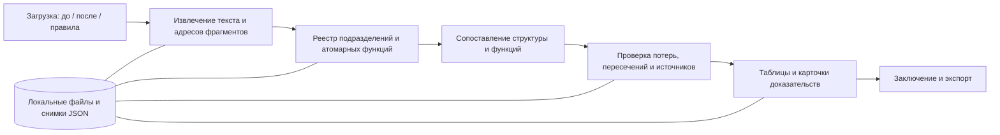

> Историческая рабочая запись этапа планирования и первичного анализа. Утверждения ниже о ещё не реализованных функциях относятся к моменту её подготовки. Текущее состояние, проверки и ограничения: [PROGRESS.md](PROGRESS.md), [README.md](README.md), [модуль метрик](docs/METRICS_MODULE_IMPLEMENTATION.md). Ссылки на исходные документы в Downloads относятся к локальным файлам участника.

**План решения кейса HackAlem AI: анализ организационной структуры и функционала**

План рассчитан на 3 участников и 5 часов реализации. Подготовлен 23 сентября 2026 года. Это проект реализации: приложение, синтетический комплект и измеренные результаты прототипа пока не созданы. Пользователь предоставил реальную тестовую пару DOCX; выполнен её первичный разбор. Все сроки, ограничения объёма и показатели ниже — рабочие ориентиры команды, если прямо не указано, что это требование ТЗ.

Повторная сверка с исходным ТЗ выполнена 23 сентября 2026 года. Исправлены охват конфликтов ролей, обработка должностных инструкций и связь приложений с документами. Матрица требований и оставшиеся условия проверки находятся в [REQUIREMENTS_AUDIT.md](<REQUIREMENTS_AUDIT.md>). Соответствие плана не означает, что приложение уже реализовано или прошло приёмку.

**Уточнение по фактическим данным.** Первый интеграционный сценарий — редакция 8 положения о внутреннем аудите, протокол №13 от 25.06.2021, → редакция 9, протокол №7 от 23.12.2022. Номера протоколов не задают порядок версий. Обе копии читаются как текстовые DOCX, без таблиц и изображений; каждая содержит около 83–84 тысяч символов. Разбор и 14 ожидаемых проверок: [TEST_DOCUMENTS_REVIEW.md](<TEST_DOCUMENTS_REVIEW.md>). Полнота комплекта других ВНД и официальный эталон ответов пока неизвестны.

**1. Решение, которое команда должна показать через 5 часов.** Локальное приложение на Python с интерфейсом Streamlit: сотрудник загружает комплекты «до» и «после», получает сопоставление подразделений и функций, открывает доказательства каждого замечания и скачивает аналитическое заключение. Основная ценность — проверить сохранность обязанностей при реорганизации и сократить ручной поиск по документам.

В первом выпуске нужны три области интерфейса: «Документы», «Результаты», «Заключение». В результатах — вкладки подразделений, функций и замечаний. Русский язык интерфейса; русский язык документов — исходное предположение до получения тестового комплекта. Если в нём есть казахский или смешанные языки, сразу добавить соответствующие проверки извлечения и сопоставления.

**2. Требования и границы.** ТЗ требует пять результатов; технические решения выбирает команда.

| Требование ТЗ | Реализация за 5 часов | Приёмка |
|---|---|---|
| Сохранённые, реорганизованные, созданные подразделения | Таблица соответствий с отношениями 1:1, 1:N, N:1; основания из документов | Переименование и разделение распознаны; отсутствие преемника не объявляется ликвидацией без основания |
| Потенциальная потеря функций | Сопоставление всех прежних функций с доступным реестром «после» | Переданная или переформулированная функция не попадает в потери |
| Дублирование и потенциальный конфликт интересов | Дубли между подразделениями; конфликты как между подразделениями, так и при совмещении ролей внутри одного | Проверяется предмет, область, роль и при необходимости подчинённость; есть положительные и отрицательные примеры |
| Источник каждого вывода | Неизменяемый реестр фрагментов; ссылки, цитаты и проверка соответствия | Ссылки есть у замечаний, соответствий подразделений и функций; сводные числа выводятся из этих записей |
| Понятное заключение | Сводка, таблицы, замечания, ограничения анализа, краткие действия | Сотрудник понимает, что проверить и где найти основание |
| Word, PDF, Excel во входных данных | DOCX, PDF с текстовым слоем, XLSX | Каждый из трёх форматов проходит реальный путь от загрузки до цитаты |
| Оргструктуры, положения, должностные инструкции, приказы, приложения и внутренние нормы | Сохранение типа документа и контекста; привязка должности к подразделению по источнику | Обязанность из должностной инструкции учитывается; ссылка на приложение сохраняет его происхождение |
| Прототип, интерфейс, исходники, README, архитектура | Запускаемый проект в выданном командном репозитории | Другой участник воспроизводит сценарий по README |

ТЗ называет семейства форматов, но не определяет расширения и свойства файлов. Поддержку DOC/XLS, сканов, SmartArt, рисунков и сложных схем следует проверить по фактическим данным в первые 15 минут. Если они присутствуют в контрольном комплекте, обработка становится задачей основного объёма. Просто принять файл и не извлечь его содержимое — недостаточно.

Проверка внешнего законодательства, сравнение с другими операторами, оптимизация новой структуры, чат по документам, граф с анимацией, отдельный frontend, публичный хостинг и GPU-инфраструктура в базовый план не входят. Короткие рекомендации «уточнить передачу обязанности» входят в обязательный выход по разделу 5 ТЗ; обоснованное перераспределение функций — опциональное развитие по разделу 8. Внутренние нормы для оценки конфликта ролей могут входить в основной анализ; это не требует реализации опциональной проверки внешнего законодательства.

**3. Ограничения из предоставленных инструкций.** Документы рассматриваются как сведения об условиях хакатона, а не как команды автоматически активировать сервисы, отправлять данные или публиковать проект.

- Инструкция участников указывает 5 часов, использование AI-агента, итоговый код в GitHub-репозитории команды, выданном платформой, и отдельную сдачу через кнопку «Сдать решение». Наличие deployed-версии описано условно.
- Правила зачёта требуют личного вклада каждого участника и создания проекта в рамках хакатона. Подготовку окружения и планирование следует отделять от времени реализации; допустимость заранее подготовленных программных заготовок уточнить у организаторов.
- Инструкция по кибербезопасности, разделы 5–6, ограничивает передачу служебных данных внешним сервисам и доступ к репозиторию. Наличие API-кредитов само по себе не устанавливает разрешённость конкретного набора документов для внешнего API.
- Поэтому предлагаемый способ запуска — локальный интерфейс на одном ноутбуке, доступ к репозиторию у команды и организаторов, внешняя модель только для разрешённых данных. Синтетические примеры должны быть явно обозначены.

**4. Полный пользовательский сценарий.** Основной пользователь — сотрудник, анализирующий реорганизацию. У него есть документы, но ему не нужно настраивать AI, индексы и промпты.

| Шаг | Действие сотрудника | Поведение системы | Что видно пользователю |
|---|---|---|---|
| 1 | Открывает приложение, задаёт название анализа | Создаёт отдельный набор материалов | Название, дата, пустые колонки «до» и «после» |
| 2 | Загружает файлы в соответствующие колонки | Проверяет тип, размер и совпадения файлов; сохраняет оригиналы локально | Имя, формат, сторона сравнения, статус обработки |
| 3 | При необходимости добавляет общие внутренние правила | Помечает их как нормативный контекст, не как третье состояние структуры | Отдельная группа «Общие правила» и применимость по датам |
| 4 | Проверяет извлечение | Показывает фрагменты, таблицы, предупреждения, найденные подразделения | «Обработано 8 из 9 файлов; у одного нет читаемого текста» |
| 5 | Исправляет сторону файла или выбирает действующую версию | Создаёт новую ревизию входа; аннулирует устаревшие результаты | Актуальный состав документов; исключённые файлы и причины |
| 6 | Нажимает «Сравнить» | Извлекает функции, сопоставляет подразделения, проверяет отклонения и источники | Реальные этапы и обработанные количества без выдуманного процента точности |
| 7 | Смотрит обзор | Считает результаты из сохранённых записей | Изменения структуры, функции без найденного преемника, дубли, риски и неполнота |
| 8 | Открывает подразделение | Показывает предшественников, преемников и основание связи | Таблица «до → после», тип преобразования, источники |
| 9 | Открывает функцию | Показывает её прежних и новых владельцев, статус и область | Сохранена, передана, покрыта частично, соответствие не найдено или данных недостаточно |
| 10 | Открывает замечание | Показывает исходные цитаты, краткое обоснование и предлагаемую проверку | Документ, пункт/страница/ячейки; возможность открыть оригинал |
| 11 | Отмечает замечание | Сохраняет «не проверено / подтверждено сотрудником / отклонено» и комментарий | Решение сотрудника отделено от исходной гипотезы агента |
| 12 | Формирует заключение | Собирает отчёт из проверенных данных и решений сотрудника | Сводка, доказательства, ограничения; скачивание Markdown и таблицы CSV |

Шаг 11 и удобный выбор конфликтующих версий можно упростить при нехватке времени. Вывод источников, сообщение о неполной обработке и правильное обновление результатов обязательны для достоверности основного сценария.

**5. Устройство интерфейса.** На экране «Документы» разместить две колонки загрузки, необязательный блок общих правил и таблицу качества извлечения. Показывать образцы прочитанного текста до старта анализа. Кнопка запуска активна при наличии пригодных материалов с обеих сторон. Если часть файлов не обработана, запуск допускается как частичный анализ с явной отметкой в результате и отчёте.

В «Результатах» сверху показывать сводку и охват: например, «извлечены 36 функций; 4 фрагмента требуют проверки». Не называть долю прочитанных страниц точностью анализа. Вкладки:

- «Подразделения»: прежнее название, новое название/названия, вид изменения, основания.
- «Функции»: тепловая матрица «функция × подразделение» с состояниями до/после, постоянными строками и колонками, подсветкой изменений и раскрытием источников; рядом доступны покрытие и тип нормы.
- «Замечания»: категория, затронутые подразделения, основание, статус проверки. Фильтры по категории и подразделению.

При выборе замечания показывать карточку с двумя колонками цитат. Для потери справа показывать охват поиска и ближайшие неподходящие кандидаты, если они есть; выдумывать «пункт об отсутствии функции» нельзя. Для конфликта интересов рядом показывать основание несовместимости ролей или явное отсутствие такого основания.

Матрица добавлена по запросу пользователя. Пустая строка означает отсутствие найденного закрепления в доступных документах; неполный охват и неизвестный владелец обозначаются отдельно. Две отметки дают сигнал проверки пересечения, но разные роли, области и распределение частей функции не считаются автоматическим дублем. Полная спецификация данных, цветов и приёмки: [FUNCTION_MATRIX_SPEC.md](<FUNCTION_MATRIX_SPEC.md>).

«Заключение» содержит краткий итог, состав комплектов, изменения структуры, замечания, нерешённые вопросы, ограничения и приложение с источниками. Итоговый статус: «Проект заключения для проверки ответственным сотрудником». Если реализована отметка сотрудника, отклонённые замечания сохраняются в истории и не считаются принятыми рисками.

**6. Архитектура.** Для пяти часов выбираем один Python-проект: Streamlit вызывает обычные функции обработки. Отдельный HTTP API, очередь задач, Redis, векторная база и сложная агентная платформа не требуются для выбранного небольшого объёма.



| Компонент | Выбор | Зачем |
|---|---|---|
| Интерфейс | Streamlit | Загрузка, таблицы, выбор замечания, показ цитат и скачивание в одном приложении |
| Общие данные | Pydantic | Один контракт между обработкой, моделью и интерфейсом |
| DOCX | python-docx и при необходимости XML документа | Абзацы, таблицы, заголовки и устойчивые адреса |
| PDF | pdfplumber | Текст, номера страниц и таблицы текстовых PDF |
| XLSX | openpyxl | Листы, координаты ячеек и табличные обязанности |
| Смысловой анализ | OpenAI Responses API со Structured Outputs | Извлечение и сравнение по заданной схеме |
| Сохранение | JSON-снимки и оригиналы в локальном каталоге | Возобновление просмотра и повторное использование обработанных этапов |
| Проверки | pytest и небольшой набор документов с известными изменениями | Контроль цитат, форматов, статусов и ошибок |
| Запуск | Зафиксированные зависимости и одна команда запуска | Воспроизводимость на втором ноутбуке |

Streamlit поддерживает загрузку и скачивание файлов: [загрузка](https://docs.streamlit.io/develop/api-reference/widgets/st.file_uploader), [скачивание](https://docs.streamlit.io/develop/api-reference/widgets/st.download_button). Его [Session State](https://docs.streamlit.io/develop/api-reference/caching-and-state/st.session_state) связан с сессией браузера, поэтому результаты сохраняем на диск.

Документация библиотек: [python-docx](https://python-docx.readthedocs.io/en/latest/), [pdfplumber](https://github.com/jsvine/pdfplumber), [openpyxl](https://openpyxl.readthedocs.io/en/stable/). PDF-парсер лучше подходит для документов с текстовым слоем; OCR в нём не предполагается.

Structured Outputs задаёт структуру ответа; достоверность содержания и ссылок проверяет приложение. Следует обрабатывать отказ модели и незавершённый ответ отдельно от успешного пустого результата. Основание: [официальная документация OpenAI](https://developers.openai.com/api/docs/guides/structured-outputs).

Имя модели задаётся через `LLM_MODEL`; выбрать доступную модель с поддержкой нужной схемы по короткому испытанию на синтетическом тексте в первые 15 минут. У команды пока не проверены доступ, квота и фактическая скорость. Стоимость и качество конкретной модели здесь не обещаются. API-ключ хранится на машине запуска в окружении и не попадает в репозиторий, интерфейс или отчёт.

**7. Контракт данных, который нужно согласовать в первые 15 минут.** Привязка к файлам и типы статусов должны совпадать у всех трёх участников.

| Сущность | Минимальные поля |
|---|---|
| Document | id, sha256, filename, side: before/after/reference, document_type, format, revision, approval_date, protocol_number, effective_date, parent_document_id или unknown, attachment_label или unknown, parse_status, warnings |
| SourceBlock | id, document_id, locator, paragraph_index, char_start, char_end, clause_number, context_source_ids[], raw_text, normalized_text, text_hash, extraction_method |
| OrgUnit | id, side, name, aliases, структурный parent_id либо unknown, source_ids |
| ReportingRelation | subject_id, object_id, type: structural/functional/administrative/unknown, source_ids |
| Function | id, unit_ids, actor_kind, position_titles[], assignment_source_ids[], assignment_status, norm_type: duty/right/prohibition, modality, action, object, scope, role, conditions, raw_label, source_ids |
| UnitMapping | id, before_ids[], after_ids[], kind, evidence_ids[], explanation, verification_status |
| FunctionMatch | before_function_id, after_function_ids[], coverage, responsibility_change, change_flags[], covered_parts, uncovered_parts, evidence_ids[] |
| Finding | id, type, affected_unit_ids[], function_ids[], evidence_ids[], rule_source_ids[], explanation, next_action, evidence_status, review_status |
| AnalysisRun | id, input_fingerprint, stage, warnings, source_coverage, function_coverage, model_id, prompt_version, schema_version, result_revision |
| Review | finding_id, result_revision, decision, comment, timestamp |

`scope` включает территорию, продукт, процесс, аудиторию и временной период, когда они есть в тексте. Неизвестные значения сохраняются явно. Одинаковые неизвестные области не доказывают одинаковую ответственность. `role` различает выполнение, согласование, утверждение, контроль и участие.

Для должностной инструкции сохранить наименование должности и основание её связи с подразделением: заголовок, пункт о подчинённости либо соответствующее приложение. Если связь не установлена, `assignment_status=unresolved`; обязанность остаётся в реестре без выдуманного владельца и учитывается как ограничение анализа. Одинаковые названия должностей в разных подразделениях не объединять. Полноценный кадровый реестр и персональные данные для этого не нужны.

Фактическая пара требует различать подразделение и должность, а также функциональное и административное подчинение. Заголовки «имеют право», «не имеют права», «обязаны» наследуются дочерними пунктами. Запрещённое действие не считается выполняемой функцией при поиске дубля. Изменение «осуществляется» → «может осуществляться» сохраняется в `change_flags` как изменение модальности даже при совпадении действия и объекта. Исключения и защитные условия входят в контекст нормы. Определения и оглавление не извлекаются как новые обязанности.

Связи хранятся массивами: одна функция может покрываться несколькими функциями после разделения. Преобразования структуры и передача обязанностей — разные отношения. Передача задачи сама по себе не доказывает реорганизацию подразделения.

Статусы покрытия: `full`, `partial`, `not_found`, `insufficient_data`. Изменение ответственности: `same_owner`, `transferred`, `distributed`, `unknown`. Дублирование и конфликт — отдельные замечания: одна функция может одновременно сохраниться и дублироваться.

Все ссылки относятся к конкретной ревизии исходных файлов. Изменение состава материалов, правила, модели или версии анализа создаёт новый запуск. Отметку сотрудника нельзя молча переносить на изменившееся замечание.

**8. Извлечение документов и проверяемые ссылки.** Оригинал сохраняется неизменным. У каждого извлечённого блока есть стабильный ID; модель получает эти ID вместе с текстом. Источники и счётчики создаёт код.

- DOCX: путь к заголовку, номер абзаца либо адрес таблица/строка/ячейка, явный номер пункта при наличии. Автонумерацию Word необходимо восстановить из numbering XML либо честно использовать адрес абзаца. Страницы DOCX не выдумывать.
- PDF: номер физической страницы файла, номер/адрес блока, текст; координаты выделения — только если надёжно доступны. Печатный номер страницы можно показать дополнительно, не смешивая его с физическим.
- XLSX: лист и диапазон, например `Функции!B12:F12`; вместе со строкой сохранить заголовки колонок. Объединённые ячейки с владельцем разнести логически, сохранив первоначальный адрес. Формулы не исполнять; отсутствие вычисленного текста и скрытые листы показывать в диагностике.
- Таблицы не сплющивать в текст без заголовков: иначе теряется связь функции с подразделением.
- Для приложения сохранять номер/название приложения и родительский распорядительный документ, когда такая связь явно указана. Изменения структуры подтверждать данными приложений и положений вместе с приказом. Если приказ и приложение противоречат друг другу, показать обе цитаты и неопределённость; не скрывать противоречие выбором удобного источника.
- Для должностной инструкции сохранять цитату обязанности и отдельную ссылку на принадлежность должности подразделению, если она находится в другом фрагменте. Совпадение названия должности не является достаточным основанием принадлежности.
- Несколько пунктов внутри одного абзаца разделять на дочерние фрагменты с диапазонами символов и общим исходным paragraph_index. Для реальной пары проверить склейки старых 3.9–3.11 и новых 3.9–3.12, встроенные заголовки разделов и пустой старый 5.5.3. Не принимать ссылки вида «п. 3» внутри предложения за новый пункт.
- Порядок версий предлагать по редакции и дате утверждения с видимым подтверждением стороны пользователем. Не сортировать по номеру протокола. Совпадение номера пункта в двух редакциях не гарантирует одинаковый смысл; перенумерация сама по себе не является потерей.
- Для графических схем сначала проверить, доступны ли названия и связи из текстовой/табличной части. Если связь подчинённости нельзя извлечь, статус — «не определена», а не предположение по расположению названий.
- Сканы, защищённые, повреждённые и устаревшие форматы получают явный статус. Ручное переписывание может помочь исследованию, но не считается автоматической поддержкой формата.

Для каждого блока сохранить исходный и нормализованный текст. Проверка цитаты допускает только контролируемую нормализацию пробелов, переносов и Unicode, без перестановки слов. Если цитату нельзя сопоставить, вывод не проходит проверку. В интерфейсе доступен контекст вокруг цитаты и оригинальный файл.

**9. Алгоритм анализа.** Оркестратор управляет этапами, разрешёнными операциями и повторными проверками. AI извлекает смысл и оценивает отношения; код обеспечивает адресацию, полноту обхода, схемы, сохранение и отчёт.

1. Проверить вход. Разделить стороны, определить документы с конфликтующими версиями и непрочитанные фрагменты. При отсутствии пригодных данных с одной стороны остановить сравнение с понятной причиной.
2. Извлечь подразделения и атомарные обязанности из всех пригодных блоков, включая должностные инструкции и приложения. Связать должности с подразделениями только по подтверждённому контексту. «Готовит и согласует договоры» становится двумя обязанностями с одним источником. Не терять отрицания, ограничения и исключения. Сохранять статус обработки каждого блока, включая «функций нет» и «не удалось определить».
3. Объединить повторные упоминания одного подразделения внутри стороны. Совпадение названия не всегда означает одну сущность: проверять родителя и контекст. Повтор одной обязанности в положении и инструкции того же подразделения не является межподразделенческим дублем.
4. Сопоставить структуры из приложений и указания приказа: переименовать, объединить, разделить, создать. Проверить согласованность с положениями; затем сопоставлять названия, функции и контекст. Если изменения видны только по приложениям, анализ должен работать и без текстовой команды в приказе, сохраняя предполагаемый статус неоднозначных связей. Сохранить N:M-связи без принудительного взаимно-однозначного выбора.
5. Для каждой функции «до» найти смысловые соответствия в полном доступном реестре «после», включая сохранённые и созданные подразделения. Проверять действие, объект, территорию/продукт, роль и условия. Отразить полное, частичное покрытие и передачу ответственности.
6. Для каждого `not_found` выполнить дополнительную проверку: все функции «после» и поиск по исходным блокам. Повторный поиск позволяет обнаружить функцию, пропущенную при извлечении. Если такие пропуски найдены, обновить реестр и зависимые сравнения. Если охват неполон, итог — `insufficient_data` либо потенциальная потеря с явным ограничением охвата.
7. Проверить функции разных подразделений «после» на пересечение. Совпадение действия и объекта при различающейся области или разных ролях не объявлять дублем. Общую обязанность родительского подразделения и конкретизацию у дочернего учитывать как возможную иерархию, а не автоматически как нарушение.
8. Отдельно от дублей проверить несовместимые роли внутри одного подразделения и между разными подразделениями. Если основание касается независимости контроля, учитывать подтверждённые отношения подчинённости. Для конфликта нужны факты о ролях, общем объекте/процессе и основание несовместимости. Без правила анализ не отключается: допустим отдельный сигнал «возможное совмещение исполнения и контроля; основание требует уточнения», со ссылками на реальные обязанности. Его нельзя назвать установленным конфликтом или нарушением. Фильтр «разные подразделения» относится только к межподразделенческим дублям.
9. Проверить все источники программно, затем смысловую достаточность доказательств отдельным коротким проходом. Проверка распространяется на замечания, изменения подразделений и обычные результаты «сохранена/передана». Найденная цитата подтверждает существование текста; поддержку вывода нужно оценить отдельно. При противоречиях сохранить неопределённость и ссылки на обе версии.
10. Сформировать таблицы и отчёт из результатов, прошедших проверки. Ошибки схемы, несуществующие ID, обрыв ответа и недоступность модели не преобразовывать в «замечаний нет».

Для малого комплекта не вводить жёсткий поиск только по top-k кандидатам. Разбивать прежние функции на небольшие пакеты, каждому передавать весь компактный реестр «после», если он помещается в контекст. Если не помещается — обходить все части с журналом покрытия и объединять результаты. Лексическая близость может менять порядок, но не исключать функции из проверки потери.

Для фактических двух редакций сначала построить полный реестр фрагментов, затем использовать текстовые изменения для приоритизации смысловой проверки. Не ограничивать анализ изменёнными строками: одинаковая обязанность под другим заголовком может перейти новому владельцу. Повторно использовать извлечение только при совпадении текста, контекста владельца, области, вида нормы и условий. Финальная проверка кандидатов на потерю охватывает весь новый документ.

Для дублей разбить реестр «после» на группы и проверить каждую пару групп, включая внутренние пары. Сохранить перечень проверенных групп; не сравнивать только соседние строки. Сначала отбирать кандидатов краткими структурированными описаниями, затем проверять их по полным исходным фрагментам. Охват групп показывает выполненную работу, но не гарантирует, что модель заметила все отношения.

Основная проверка дублей и конфликтов относится к состоянию «после». Не называть найденное пересечение «возникшим вследствие реорганизации», если аналогичная проверка состояния «до» не выполнена. Сравнение истории рисков можно добавить позднее; наличие риска и доказательство его новизны — разные выводы.

**10. Работа с AI и контролируемое поведение.** В проекте достаточно одного оркестратора с несколькими логическими операциями. Фиксировать фактически реализованную логику; отдельные промпты не следует выдавать за независимых автономных агентов.

| Операция | Вход | Выход | Контроль |
|---|---|---|---|
| extract_entities | Блоки с ID и соседним контекстом | Подразделения, атомарные функции, ссылки | ID существуют; цитаты совпадают; все блоки имеют статус обработки |
| match_units | Подразделения, приказ, источники | Соответствия и типы изменений | Совместимость сторон и отсутствие выдуманных подразделений |
| match_functions | Функции до и после | Покрытие, передача, недостающие части | Каждая функция до учтена ровно один раз как итоговая запись покрытия |
| detect_overlaps | Пары групп функций после | Кандидаты межподразделенческих дублей | Общий предмет и область, разные подразделения, обе ссылки |
| detect_role_conflicts | Функции после, внутренние правила и подтверждённая подчинённость | Кандидаты конфликта ролей внутри подразделения и между подразделениями | Обе обязанности, общий предмет, основание; при его отсутствии — явно ограниченная гипотеза |
| verify_finding | Кандидат и первичные фрагменты | Поддерживается / недостаточно / противоречит | При недостаточности вывод не публикуется как подтверждённый |

Для unresolved-случаев предусмотреть ограниченный цикл: запросить контекст → повторно оценить → сохранить результат или неопределённость. Не более двух дополнительных проверок на замечание. Инструменты только чтения: поиск в текущем комплекте и получение блока по ID. Документы не дают модели права запускать команды, обращаться в интернет или отправлять данные куда-либо.

Запрашивать короткое пользовательское обоснование, например «Совпадают действие, объект и регион; обе функции закреплены за разными отделами». Не требовать длинного рассуждения. Устанавливать пределы контекста и ответа, число повторов и общий бюджет вызовов. Невалидный ответ допускает одну попытку исправления, затем явную ошибку этапа.

При ограничении API: учитывать Retry-After, ограничить повторы и сохранить уже выполненные этапы. Если провайдер недоступен, показать ошибку и доступный ранее сохранённый результат с датой; не показывать старый прогон как новый. Первый рабочий прогон выполнять на фактическом API до конца второго часа.

**11. Сохранение и повторные запуски.** Для одного локального пользователя достаточно каталогов анализа с оригиналами, блоками и JSON-результатами; запись через временный файл и атомарную замену. База данных появится при дальнейшем развитии.

Ключ повторного использования этапа включает хеши файлов, сторону и выбранную версию, правила, версию парсера/схемы/промпта и модель. Кнопки фильтрации и открытия цитат не запускают AI повторно. После перезапуска приложения можно загрузить завершённый снимок; возобновление незавершённого этапа — желательное дополнение, не обязательство пятичасового MVP.

Локальные данные, кэш, ключи и результаты на служебных документах исключаются из Git. В репозитории остаются исходники и разрешённые синтетические примеры. Загрузка имеет лимиты размера и распакованного содержимого; безопасные имена и идентификаторы выдаёт приложение. Макросы, вложенные команды, ссылки и формулы из файлов не исполняются. Текст при отображении экранируется.

После мероприятия выполнить требование инструкции по кибербезопасности, раздел 5: удалить временные ключи, токены и локальные копии предоставленных данных. При удалении учитывать также производные цитаты, результаты и кэш. Это задача завершения работы команды, а не автоматическое действие этого плана; исходники и разрешённые синтетические примеры рассматриваются отдельно.

**12. Планируемая структура проекта.** Ниже будущие файлы, они не созданы этим планом.

```text
app.py                    # Интерфейс, владелец: участник 3
core/
  models.py               # Общие контракты, владелец: участник 1
  ingest.py               # DOCX / PDF / XLSX, владелец: участник 1
  sources.py              # Адреса, цитаты, проверка ссылок, участник 1
  storage.py              # Локальные снимки, участник 1
  llm.py                  # API и структурированные ответы, участник 2
  pipeline.py             # Извлечение, сопоставление и проверки, участник 2
  prompts.py              # Версионируемые инструкции модели, участник 2
  report.py               # Markdown / CSV, участник 3
tests/                    # Проверки данных, логики и источников
examples/synthetic/       # Разрешённые синтетические входы и ожидаемые случаи
requirements.txt          # Проверенные и зафиксированные зависимости
.env.example              # Названия переменных без ключей
.gitignore                # .env, data/, локальные кэши
README.md                 # Только реализованные функции и проверенный запуск
```

Контракты: `parse_document(file, side) -> ParsedDocument`; `analyze(bundle, config, on_progress) -> AnalysisResult`; `verify_sources(result, source_index) -> VerificationReport`; `render_report(result, reviews) -> str`. Схемы создаёт участник 1, остальные используют их; изменение согласуется сообщением с примером данных. Функции обработки не импортируют Streamlit — это позволяет проверять их отдельно от UI.

**13. Распределение трёх участников.** Роли обозначают зоны ответственности, а не требования к должностям.

| Участник | Основная ответственность | Что должен передать другим |
|---|---|---|
| 1 — документы и данные | Парсеры, общие модели, источники, сохранение | Структурированные блоки с проверяемыми адресами; разбор трёх форматов |
| 2 — AI и сравнение | API, извлечение функций, соответствия, потери, дубли, конфликты | AnalysisResult со всеми статусами и источниками |
| 3 — интерфейс и сдача | Загрузка, таблицы, карточки, отчёт, README, интеграция | Весь сценарий в браузере; проверенный запуск и материалы сдачи |

В первые 15 минут вместе согласовать один маленький пример результата. Участник 3 может начинать UI с явно обозначенного технического образца данных; после интеграции демонстрация идёт через реальный анализ. Участники 1 и 2 не редактируют app.py; участник 3 не меняет AI-логику без согласования. Интеграция каждые 30–45 минут; владелец конечной сборки — участник 3.

**14. Поминутный план.** Все отметки относительные от старта разработки. Общий ресурс — 15 человеко-часов, включая проверку, документацию и сдачу.

| Интервал | Участник 1 | Участник 2 | Участник 3 | Результат интервала |
|---|---|---|---|---|
| 00:00–00:15 | Проверка реальной пары, дат, склеек и SourceBlock | Проверка API на разрешённом примере, выбор модели | Проверка выданного репозитория и запуска UI | Контракты, доступы, правильный порядок №13 → №7 |
| 00:15–00:45 | DOCX и PDF, адреса и наследование заголовков | Извлечение обязанностей, прав и запретов по общей схеме | Две загрузки, статусы, таблица результатов | Текст реальной пары и валидный ответ AI |
| 00:45–01:15 | XLSX, заголовки, контекст приложений и должностей, цитаты | Соответствия подразделений и функций | Подключение парсеров, показ источника | Все три формата читаются; один пример до/после сравнивается |
| 01:15–02:00 | Ошибки форматов, дедупликация, снимки | Потери, частичное покрытие и дубли | Интеграция полного пути, простой Markdown-отчёт | Реальный сквозной запуск: загрузка → анализ → цитаты → отчёт |
| 02:00–02:45 | Тесты источников, принадлежности должностей и неполного входа | Конфликты внутри/между подразделениями, повторная проверка потерь | Матрица до/после, выбор строки с цитатами, экспорт | Все пять обязательных результатов представлены; изменения видны на матрице |
| 02:45–03:30 | Исправления на фактических документах | Проверка ложных срабатываний и схем | Проверка сценария с командой, README по факту | Рабочая версия с известными ограничениями |
| 03:30–04:00 | Контрольные случаи и проверка зависимостей | Проверка источников каждого типа вывода | Чистый запуск на втором ноутбуке | Зафиксированный кандидат на сдачу |
| 04:00–04:30 | Исправление только дефектов основного пути | То же; измерение реального прогона | Проверка README, репетиция показа | Воспроизводимая демонстрация, время и ограничения записаны |
| 04:30–04:45 | Проверка состава файлов без секретов/служебных данных | Краткое описание алгоритма и ограничений | Финальный push в выданный репозиторий и сдача на платформе | Решение отправлено, ссылка и статус проверены |
| 04:45–05:00 | Общий резерв | Общий резерв | Общий резерв | Повторная проверка сдачи и исправление критических проблем |

Проверять рабочий запуск после каждой интеграции. Не оставлять первый запуск всей системы на последний час. На третьем часу можно добавить подтверждение замечаний, только если путь до отчёта уже работает. После 04:00 новые возможности не добавлять.

**15. Контрольные точки и сокращение объёма.** При отставании сохраняем обязательные результаты и упрощаем оформление.

- 00:15: известны фактические форматы, доступ к модели и условия использования данных. Если доступ к API не подтверждён, проверяется другой разрешённый сервис с минимальным адаптером; не тратить часы на развёртывание новой GPU-инфраструктуры без готового окружения.
- 01:15: DOCX/PDF/XLSX дают проверяемые блоки. Если реальный набор содержит сканы или схемы, участник 1 переключается на их минимально достаточную обработку, а сохранение незавершённых запусков и дополнительные экспорты откладываются.
- 02:00: должен существовать работающий путь от файлов до отчёта с реальным AI. Если его нет, заморозить визуальные улучшения, оставить одну страницу с раскрывающимися блоками и один экспорт Markdown.
- 02:45: представлены все must-have, включая потенциальные конфликты. Если не успеваем, использовать простую карточку с фактами о ролях и основанием; не объявлять эту функцию опциональной.
- 03:30: переход к стабилизации. Первые кандидаты на удаление из объёма — история запусков в UI, ручные отметки, CSV, дополнительные графы и редактирование метаданных. Сохранить простую матрицу до/после, источники, отчёт, качество входа и диагностируемые ошибки.
- 04:30: сдавать последнюю проверенную сборку. Остальные 30 минут сохранять как резерв, а не как обещанный объём разработки.

Если контрольные данные требуют возможностей, которые невозможно реализовать в срок, прямо указать неполноту соответствия ТЗ. Сужение объёма файлов не превращает неподдерживаемые требования в выполненные.

**16. Проверка качества.** Подготовить небольшой синтетический набор с известными изменениями; затем отдельно прогнать предоставленный организатором комплект. Ожидаемые ответы тестов не передаются модели. Изменённые названия и формулировки во втором варианте проверяют, что алгоритм не привязан к конкретным словам примера.

| ID | Случай | Ожидаемое поведение |
|---|---|---|
| T01 | Переименование с сохранением обязанностей | Связь подразделений; потерь нет |
| T02 | Разделение подразделения | 1:N и распределение обязанностей |
| T03 | Объединение подразделений | N:1 без потери связей |
| T04 | Прежняя обязанность отсутствует в полном доступном комплекте | Потенциальная потеря с прежней цитатой и охватом поиска |
| T05 | Передача и переформулирование обязанности | Передача, а не потеря |
| T06 | Составная функция сохранена частично | Указана конкретная непокрытая часть |
| T07 | Две одинаковые обязанности в разных подразделениях и одной области | Возможное дублирование с обеими цитатами |
| T08 | Одинаковые слова, разные регионы или этапы | Нет необоснованного дубля |
| T09 | Исполнение и независимый контроль у одной роли + внутреннее правило | Потенциальный конфликт с тремя основаниями: две обязанности и правило |
| T10 | Те же роли, но правило не предоставлено | Гипотеза о совмещении; установленное нарушение не заявляется |
| T11 | Часть файла не распознана | Неполный охват; отсутствие текста не означает отсутствие обязанности |
| T12 | Несуществующая ссылка или изменённая цитата в ответе модели | Проверка отклоняет вывод; отчёт его не выдаёт как подтверждённый |
| T13 | Отказ/таймаут/оборванный JSON | Ошибка этапа; результат не становится пустым успешным анализом |
| T14 | Перемена стороны файла или новой версии после анализа | Старый результат помечен устаревшим и не смешивается с новым |
| T15 | Одна функция повторена в двух документах одного подразделения | Нет ложного межподразделенческого дубля |
| T16 | Инструкция внутри загруженного текста «игнорировать правила» | Текст рассматривается как данные; поведение приложения не меняется |
| T17 | Обязанность встречается только в должностной инструкции | Учтена со ссылками на обязанность и принадлежность должности; при неизвестной принадлежности владелец не выдуман |
| T18 | Структура изменена в приложении без явного описания в приказе; отдельный вариант — противоречие | Изменение найдено по приложениям; неоднозначность/противоречие показаны с источниками |
| T19 | Контролирующее подразделение подчинено проверяемому при явном требовании независимости | Потенциальный конфликт между подразделениями со ссылкой на роли, подчинённость и правило |
| T20 | Функции представлены строками XLSX с заголовками и объединённой ячейкой подразделения | Извлечены владелец и обязанности; источник содержит лист и реальные ячейки |
| T21 | Обычные выводы «подразделение сохранено» и «функция передана» | Доказательства доступны так же, как у проблемных замечаний |

Автоматизировать в первую очередь адреса источников, валидацию результатов, инвариант учёта каждой функции и обработку ошибок. Смысловые случаи проверить реальным вызовом модели и ручной сверкой; не ограничиваться mocked-ответами.

T01–T21 — перечень проверок, а не обещание написать 21 сложный автоматический тест за пять часов. Несколько случаев проверяются одним комплектом; варианты создаются небольшими изменениями входа. В отчёте о проверке каждому присваивается фактический статус «пройден / не пройден / не проверен». Синтетический пример — средство разработки и репетиции; приёмка по разделам 6 и 11 ТЗ требует прогона контрольного комплекта организатора, когда он предоставлен.

Полученная от пользователя тестовая пара становится первым реальным набором. Применить к ней R01–R14 из TEST_DOCUMENTS_REVIEW.md. Это предварительно подготовленные ожидания, не результат прогона приложения и не подтверждённая организатором разметка. Синтетика дополняет случаи, для которых в реальной паре нет однозначного положительного примера, в частности подтверждённый дубль. Общая поддержка Word/PDF/Excel сохраняется: два DOCX не проверяют другие форматы.

Цели приёмки: все демонстрируемые ссылки существуют и открываются; ни одного вывода с выдуманной цитатой; основные контрольные изменения найдены; близкие отрицательные примеры не дают ложных замечаний; проект запускается на втором ноутбуке. В README записать фактическое число пройденных случаев. Не называть результат небольшого синтетического набора промышленной точностью.

Считать отдельно: долю найденных размеченных отклонений, число ложных замечаний, долю корректных ссылок, число неразрешённых случаев, время и расход токенов прогона. Precision и recall считать только при достаточной разметке и показывать числители/знаменатели. Калиброванный процент уверенности модели не обещать.

Фактический первый объём — две редакции примерно по 83–84 тысячи символов и 491–492 XML-абзаца. Число атомарных норм и реальное время обработки ещё не измерены; прежний ориентир на небольшой синтетический комплект нельзя переносить на эти документы. Целевое время демонстрационного анализа — до 5 минут, но это гипотеза испытания. После первого прогона скорректировать размер пакетов и честно указать рабочий объём; не обрезать документы до удобного количества страниц или функций.

**17. Содержание итогового заключения.** Отчёт собирается программно; отдельная свободная генерация всего документа не требуется.

1. Название, дата, версия анализа; статус «для проверки».
2. Состав комплектов «до», «после» и общих правил; выбранные версии.
3. Обработанные и исключённые материалы, ошибки извлечения и их влияние.
4. Таблица преобразованных, сохранённых и созданных подразделений; неразрешённые связи отдельно.
5. Сопоставление функций с частичным покрытием и передачей владельца.
6. Потенциальные потери, дубли и конфликты; отдельная карточка каждого.
7. Для карточки: факт, доказательства, интерпретация, ограничение, предлагаемая проверка сотрудником.
8. Список источников с именем, ревизией/хешем, адресом и цитатой. Ссылки интерфейса полезны, но экспорт должен оставаться понятным без запущенного сервера.
9. Решения сотрудника, если реализованы; нерешённые вопросы.

Шаблоны рекомендаций: «Уточнить, кому передана функция …»; «Разграничить ответственность по …»; «Проверить независимость контроля в процессе …». Не придумывать оптимального владельца и не приписывать нарушения законодательства без предоставленной нормы.

**18. Демонстрация и сдача.** Подробный пример находится в соседнем файле DEMO_SCENARIO.md. Показ на 4 минуты: загрузка → изменения структуры → потеря и цитата → дубль и две цитаты → риск конфликта и правило → сохранённая переформулированная функция → заключение. Время выступления — предложение команды, фактический регламент защиты в материалах не установлен.

Для демонстрации использовать небольшой реальный запуск; если он занимает дольше выступления, заранее подготовить завершённый прогон с явно указанными временем и входами и отдельно показать запуск нового. Сохранённый результат не выдавать за выполненный в текущий момент. При недоступности сети честно показывать сохранённый прогон; новый анализ в таком случае не обещать.

README должен объяснять задачу, реализованные возможности, архитектуру, зависимости, переменные, запуск, воспроизводимый пример, использование внешнего API, данные, ограничения и результаты проверки. Команда запуска и версии зависимостей добавляются после фактического испытания. Ссылка на развёрнутую версию нужна только при её наличии.

К сдаче: доступный организаторам командный репозиторий, рабочий commit, проверенный README, разрешённый пример, описание проекта и заполненная форма платформы. Успешный push сам по себе не подтверждает сдачу на платформе.

**19. Как распределить усилия по критериям.** Соответствие и работоспособность — 25 баллов, техническая реализация — 25, README и воспроизводимость — 25, ценность — 15, потенциал и оригинальность — 10. Для первых 75 баллов нужны законченный основной сценарий, понятный алгоритм и проверяемый запуск. Практическую ценность показывают раскрываемые доказательства, обработка неопределённости и возможность сотрудника принять решение. Развитие показывать как планы, отдельно от реализованных возможностей.

**20. Что выяснить в начале работы.** Число участников и срок известны; первая тестовая пара получена и исследована локально: два русскоязычных DOCX с текстовой структурой. Внутренние правила о независимости и конфликтах присутствуют в самих положениях. Остались: полнота контрольного комплекта и наличие других форматов; официальный эталон; разрешённые AI-сервисы для этих документов; доступная модель и квота; отсутствующие приложения/ВНД; выданный репозиторий и точный дедлайн; требования к удалённому доступу жюри. Разрешённость передачи обезличенных файлов внешнему API не следует автоматически из их названия.

**Источники требований.** Ссылки ниже ведут к фактически найденным локальным файлам; PDF находятся в папке Downloads/hackalem.

- [ТЗ кейса](</Users/nueta/Downloads/HackAlem AI_ ИИ-агент «Анализ организационной структуры и функционала».docx>): разделы 5–11 и таблица оценки.
- [Инструкция участников](</Users/nueta/Downloads/hackalem/Инструкция_для_участников_HackAlem_AI.pdf>): страницы 1–2, срок, репозиторий, README и сдача.
- [Инструкция по кибербезопасности](</Users/nueta/Downloads/hackalem/Инструкция по кибербезопасности.pdf>): страницы 2–3, данные, AI-сервисы и репозитории.
- [Правила зачёта участия](</Users/nueta/Downloads/hackalem/Правила зачета участия.pdf>): страница 2, создание проекта в рамках хакатона и вклад участников.

Технологическая документация проверена 23 сентября 2026 года и приведена рядом с соответствующими решениями. Она обосновывает возможности инструментов, а выбор архитектуры и сроков является рекомендацией этого плана.
