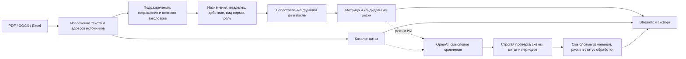

# QAITU — сравнение структуры и функций до/после

Прототип для кейса HackAlem AI «Анализ организационной структуры и функционала». Загрузите два комплекта документов: приложение сопоставит подразделения и назначения функций, покажет изменения в тепловой матрице и сформирует список вопросов для экспертной проверки с цитатами.

Объединённая версия сохраняет проверенный разбор исходных PDF/DOCX и сопоставление переименованных подразделений по профилю функций, а также добавляет контекст владельца и заголовка, сокращения подразделений, права и запреты, сопоставление нескольких назначений одной функции и матрицу «функция × подразделение».

## Запуск за несколько минут

Нужен Python 3.10 или новее. Команды выполняются из корня репозитория.

```bash
python3 -m venv .venv
source .venv/bin/activate
python -m pip install -r requirements.txt
python -m streamlit run app.py
```

В Windows PowerShell активация окружения: `.venv\Scripts\Activate.ps1`.

Откройте локальный адрес Streamlit из терминала, обычно `http://localhost:8501`. Нажмите **«Запустить контрольный пример»** — API-ключ и собственные файлы для демо не нужны. Без настроенного API-ключа выбран локальный режим. При наличии серверного ключа выбран режим «ИИ + локальное сравнение»; запрос отправляется только после нажатия кнопки сравнения или контрольного примера. Режим можно переключить до запуска.

Docker:

```bash
docker build -t qaitu .
docker run --rm -p 8501:8501 qaitu
```

## Сценарий работы

1. Загрузите положения, приложения с текстовой оргструктурой, должностные инструкции или другие внутренние документы в комплекты **«До изменений»** и **«После изменений»**. Поддерживаются PDF с текстовым слоем, DOCX, XLSX и XLSM. Порядок версий задаёт пользователь.
2. Выберите **«Режим сравнения»**: **«ИИ + локальное сравнение»** или **«Локальное сравнение»**, затем нажмите **«Сравнить документы»**. В режиме ИИ текст документов передаётся в OpenAI. Проверьте статус обработки и предупреждения.
3. Во вкладке **«ИИ-сравнение»** проверьте смысловые изменения и цитаты обеих редакций. Сравните перечни подразделений во вкладке **«Структура»** и откройте **«Матрица функций»**. В одной строке матрицы собраны соответствующие назначения функции, в колонках — подразделения до и после.
4. Отфильтруйте строки по виду нормы, статусу или тексту. Выберите интересующую строку в списке над матрицей и проверьте обе версии цитат и заголовки, из которых определён владелец. Во вкладке **«Заключение»** просмотрите краткий обзор охвата, изменений структуры и кандидатов на потерю, дублирование и конфликт ролей. Полный каталог цитат доступен в скачиваемом отчёте. Во вкладке **«Источники и охват»** доступен поиск по всему каталогу.
5. Скачайте результат для проверки командой. JSON содержит каталог источников, назначения, матрицу и выводы; Markdown — читаемое заключение с рекомендациями и полным каталогом цитат.

Каждая ссылка состоит из названия документа, локатора и `source_id`. Для DOCX используется абзац или строка таблицы, для PDF — физическая страница, для Excel — лист и строка. Локатор не заменяет напечатанный номер пункта: номер сохраняется в тексте, если он присутствует в извлечённом фрагменте.

## Как читать матрицу

| Состояние | Значение |
|---|---|
| Назначение сохранено | В обоих комплектах найдено соответствующее закрепление за владельцем |
| Назначение добавлено или передано | Изменился набор владельцев функции |
| Ответственный после не найден | Для старой функции не найдено достаточно близкого назначения в доступном новом тексте; это кандидат на проверку |
| Несколько владельцев | Нужно проверить разделение ролей и областей ответственности; количество отметок само по себе не доказывает дубль |
| Недостаточно данных | Новый комплект не дал достаточного материала для сопоставления |

Синий цвет обозначает изменения назначений, красный — отсутствие найденного преемника, жёлтый — возможное пересечение. `?` означает неопределённость, `×` — отсутствие подразделения в перечне выбранной версии, точка — отсутствие прямого назначения. Матрица выводится страницами; фильтры не меняют глобальный вывод и полный экспорт.

Повторение одного назначения в положении и должностной инструкции сохраняет оба источника, но не создаёт второго владельца. Сопоставление учитывает отношения «один ко многим» и «многие к одному», включая разделение одной составной прежней обязанности на несколько новых пунктов. Права и запреты отделяются от обязанностей; запрет выполнять процесс не считается его исполнением. Титульные утверждения и разделы определений не превращаются в назначения функций.

## Демонстрация для жюри

Встроенный пример — **синтетический** комплект, который можно показывать без исходных документов организатора.

| Шаг | Ожидаемое наблюдение |
|---|---|
| Подразделения | Отдел внутреннего аудита заменён департаментом; создано Управление аудита закупок |
| Передача | Разработка методики и ведение реестра переданы от Сектора методологии |
| Возможная потеря | В новом комплекте не найдено проверки антикоррупционных требований |
| Возможный дубль | Аудит закупок закреплён за двумя подразделениями |
| Потенциальный конфликт | Управление аудита закупок выполняет закупочные процедуры и проверяет их |
| Доказательства | У каждого вывода видны исходные фрагменты; назначения матрицы также имеют источники |

Демо проверяет положительные случаи. Оно не является оценкой точности на произвольных корпоративных документах.

## Проверки

Все автоматические тесты выполняются локально, без API-ключа:

```bash
python -m unittest discover -s tests -v
```

Тесты внешнего API используют подменённые ответы; успешный вызов оплачиваемой модели ими не проверяется. Автоматические проверки интерфейса проверяют сценарии и состояние Streamlit, но не заменяют просмотр в браузере. Проверки не измеряют полноту извлечения всех обязанностей или точность на произвольном корпусе.

Регрессионные сценарии проверяют владельцев по сокращениям и заголовкам, общие обязанности нескольких подразделений, наследование запретов, отсутствие переноса владельца между файлами, перенумерацию прав, сохранение источников и отсутствие ложной потери при объединении назначений.

Для локальной проверки двух предоставленных редакций положения о внутреннем аудите есть отдельный скрипт. Документы в репозиторий не включены:

```bash
python scripts/check_real_documents.py \
  --before "/path/to/edition-8.pdf" \
  --after "/path/to/edition-9.docx"
```

Правильный порядок этой пары: редакция 8 (2021 год, протокол №13) → редакция 9 (2022 год, протокол №7). Скрипт проверяет выбранные вручную условия: два новых департамента, сохранение прежних, передачу отдельных назначений СВК, отчётность ДККМ, права после перенумерации, сопоставление составной обязанности с двумя новыми пунктами, отсутствие титула и определений среди функций и существование источников. Он печатает `PASS` / `FAIL` и завершает работу с ненулевым кодом при несоответствии. Это ограниченная приёмочная выборка, не официальный датасет и не полная проверка всех выводов.

Если PDF отдаёт по одному слову в строке, извлечение автоматически использует режим восстановления расположения текста. Для сканированных страниц без текстового слоя по-прежнему нужен OCR.

## Архитектура



| Модуль | Назначение |
|---|---|
| `qaitu/extractors.py` | Чтение файлов, адресуемые фрагменты и предупреждения |
| `qaitu/analyzer.py` | Каталог подразделений, контекст назначений, лексическое сопоставление и индикаторы рисков |
| `qaitu/models.py` | Структуры данных, строки матрицы и сериализация результата |
| `qaitu/ai_agent.py` | Смысловое сравнение через OpenAI, проверка цитат и статус обработки |
| `qaitu/ai_reviewer.py` | Пакетирование больших комплектов и прежний дополнительный проход проверки |
| `qaitu/config.py` | Серверные настройки OpenAI из окружения или локального файла секретов |
| `qaitu/reporting.py` | Читаемый отчёт Markdown и полный каталог доказательств |
| `qaitu/demo.py` | Контрольный синтетический комплект |
| `app.py` | Загрузка, запуск, матрица, просмотр доказательств и экспорт |
| `tests/` | Воспроизводимые проверки поведения на синтетических данных |
| `scripts/check_real_documents.py` | Локальная приёмочная выборка для редакций 8 и 9 |
| `scripts/compare_with_ai.py` | Явный платный запуск ИИ-сравнения без интерфейса |

Назначение функции хранит исходный фрагмент и контекст владельца. Строка матрицы объединяет соответствующие назначения обеих версий; исходные цитаты не заменяются сгенерированным текстом. Неопределённый владелец остаётся явно неопределённым.

## Подключение OpenAI

Задайте ключ одним из способов. Примеры ниже содержат только заглушку — настоящий ключ не должен попадать в README или Git.

**Переменные окружения** перед запуском Streamlit:

```bash
export OPENAI_API_KEY="<ваш API-ключ>"
export OPENAI_MODEL="gpt-5.4-mini"
python -m streamlit run app.py
```

**Локальный файл** `.streamlit/secrets.toml` в корне проекта:

```toml
OPENAI_API_KEY = "<ваш API-ключ>"
OPENAI_MODEL = "gpt-5.4-mini"
```

Файл секретов исключён из Git и контекста Docker-сборки. Переменные окружения имеют приоритет над файлом. `OPENAI_MODEL` необязателен; по умолчанию используется `gpt-5.4-mini`. Модель должна быть доступна вашему проекту OpenAI и поддерживать Responses API со Structured Outputs. Само чтение настроек не отправляет API-запросов. Файл `.env` автоматически не загружается.

В Docker передайте уже заданные переменные при запуске контейнера:

```bash
docker run --rm -p 8501:8501 --env OPENAI_API_KEY --env OPENAI_MODEL qaitu
```

В интерфейсе серверный ключ не отображается. Для разового переопределения доступны поле пароля и модель в **«Настройки ИИ-агента»**. Внешние вызовы выполняются только в режиме **«ИИ + локальное сравнение»** после явного запуска сравнения. Локальный режим не требует ключа и не отправляет документы в OpenAI.

### Запуск ИИ-сравнения без интерфейса

Следующая команда **отправляет документы в OpenAI и расходует API-бюджет**. Она использует те же серверные настройки, что и приложение:

```bash
python scripts/compare_with_ai.py \
  --before "/path/to/edition-8.pdf" \
  --after "/path/to/edition-9.docx" \
  --output "/path/to/new-private-report.json"
```

Для нескольких файлов повторите `--before` или `--after`. `--output` необязателен; существующий файл не перезаписывается. В терминал выводятся статус и счётчики, а полный JSON с цитатами записывается только по указанному пути с правами доступа владельца на системах POSIX. Не размещайте такой отчёт в публичном репозитории. Код завершения `0` означает результат `completed` **или** `partial`; точный охват нужно смотреть в статусе. Эта команда не входит в локальный набор тестов.

## Что делает ИИ-сравнение

OpenAI получает извлечённые фрагменты обеих версий с идентификаторами, адресами источников и сведениями о документах. В пакетном режиме подбор фрагментов дополнительно использует локальное сопоставление. Модель выделяет смысловые соответствия: сохранение, изменение формулировки, перенос, добавление и возможную утрату закрепления. Отдельно она может добавить кандидатов на потерю, дублирование и конфликт ролей. Поддерживаемый формат ответа задан строгой JSON-схемой.

Каждый принятый результат имеет существующие `source_id` и точные цитаты из переданных фрагментов. Для сопоставления проверяются стороны «до» и «после»; выдуманная ссылка, неверная цитата или неподходящий период отклоняются. У возможной потери приводятся старое назначение и рассмотренный новый контекст, но даже это не доказывает отсутствия функции во всей организации. Существование цитаты **не гарантирует**, что модель верно истолковала её смысл: вывод проверяет сотрудник.

После проверки цитат второй запрос проверяет обоснованность каждого предложенного вывода по его источникам и соседнему контексту. Он отсеивает неподтверждённые утверждения, например потерю функции по одному заголовку должности или дубль между разными предметными областями. Приложение показывает только выводы, прошедшие оба этапа; если второй этап недоступен, непроверенные ИИ-выводы исключаются, а локальный результат сохраняется. Второй запрос тоже является модельной проверкой, а не гарантией правильности. По умолчанию используется `gpt-5.4-mini`: `reasoning: low` для сравнения и `high` для перепроверки; другие совместимые модели можно задать в настройках.

Результаты во вкладке **«ИИ-сравнение»** — выбранные моделью значимые изменения, а не полный построчный аудит. Локальные назначения и матрица сохраняются отдельно: ИИ не переписывает их автоматически. Принятые ИИ-кандидаты на риски дополняют заключение и включаются в экспорт.

Если весь каталог помещается в лимит 600 000 символов JSON, он передаётся одним запросом. Для более крупных комплектов используются до 8 пакетов по 60 000 символов; связи вне конкретного пакета могут быть пропущены. Цитаты не обрезаются. Бюджет запуска запросов — 180 секунд, таймаут отдельного запроса — до 90 секунд и не больше оставшегося бюджета; автоматических повторов нет. Ограничение времени проверяется между запросами и не гарантирует остановку сетевой операции ровно по таймеру.

Проверка обоснованности добавляет один запрос при наличии кандидатов, всего до 9 запросов за запуск. Её пакет ограничен 160 000 символов и тем же оставшимся временным бюджетом. В него обязательно входят источники проверяемых выводов; дополнительный контекст включается целыми фрагментами в пределах лимита.

Статус обработки отражает фактический результат:

| Статус | Что произошло |
|---|---|
| Завершено | Все запланированные запросы дали пригодные ответы, доступный каталог охвачен; это не гарантия исчерпывающего анализа |
| Частично | Получен ответ, но часть материала или выводов не обработана либо отклонена; также возможны ограничения извлечения исходных файлов |
| Не завершено | Получить пригодный ответ ИИ не удалось; показан локальный результат |
| Не запускалось | ИИ не запускался, например выбран локальный режим или отсутствует ключ |

Счётчики отправленных и обработанных источников, запросов и доступные данные о токенах показываются отдельно. Если API не вернул расход для всех запросов, значение помечается как неполное или недоступное; это не означает нулевой расход. Передача фрагмента модели не равна проверенному смысловому выводу по этому фрагменту. При отказе, сетевой ошибке или некорректном ответе локальный анализ остаётся доступным. Технические сообщения не содержат ключа или полного текста ошибки провайдера.

Содержимое загруженных документов передаётся как анализируемые данные. Инструкции внутри файлов не являются командами пользователя агенту.

## Ограничения

- Локальный анализ использует правила и лексическое сходство. Сильные перефразировки, сложная вложенность, неоднозначные должности и нетипичные сокращения могут быть распознаны неверно. Коэффициенты сходства — технические оценки, а не калиброванная вероятность правильности.
- Матрица отражает **распознанные назначения в загруженном комплекте**. Пустота не доказывает, что функцию никто не выполняет в организации; отсутствующая инструкция или ссылка на непредоставленное приложение может изменить вывод.
- Несколько владельцев требуют проверки предмета, роли и области ответственности. Автоматически подтвердить конфликт интересов или юридическое нарушение прототип не может.
- Лимиты чтения: файл до 25 МБ, распакованный документ до 100 МБ, до 20 000 фрагментов и 5 млн символов; PDF до 1 000 страниц, Excel до 50 листов, 10 000 строк и 200 столбцов на лист. Превышение отклоняется с сообщением, а не скрытым обрезанием.
- OCR сканов и распознавание оргсхем из изображений не реализованы. Сложные PDF, таблицы и автоматическая нумерация Word могут требовать ручной сверки.
- Нет полного семантического графа, согласования решений экспертом, сравнения с законодательством и бенчмаркинга других операторов. Эти функции не заявлены как реализованные.
- Прототип предназначен для демонстрации и экспертного рассмотрения; это не система с промышленными гарантиями полноты и точности.

## Работа с данными

Загруженные файлы обрабатываются в памяти процесса; приложение не записывает их в репозиторий. При удалённом размещении файлы поступают на сервер, где запущен Streamlit. API-ключ берётся из серверных настроек либо разово вводится в поле пароля; он не включается в отчёты. Не добавляйте ключи, реальные документы и выгрузки с их цитатами в Git. Встроенный синтетический пример не содержит данных организатора.
