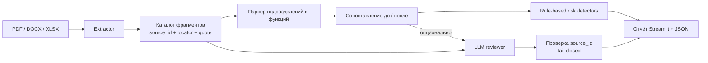

# QAITU — анализ организационных изменений

Работающий прототип агента, который сравнивает документы «до» и «после» реорганизации, находит изменения структуры и функций и показывает доказательство для каждого вывода.

## Что уже работает

- загрузка нескольких PDF, DOCX и XLSX в комплекты «до» и «после»;
- извлечение текста с адресом источника: документ + страница, абзац или строка листа;
- определение сохранённых, преобразованных, исключённых и новых подразделений;
- таблица соответствия функций со статусами «сохранена», «передана», «изменена», «потеряна», «новая»;
- индикаторы возможной потери функции, дублирования и конфликта ролей;
- раскрытие каждого вывода до исходной цитаты и `source_id`;
- итоговый экран и экспорт полного результата в JSON;
- встроенный контрольный пример, который запускается без документов и API-ключа;
- опциональная смысловая LLM-перепроверка. Ответ модели проходит fail-closed валидацию: вывод без существующего `source_id` отбрасывается.
- для положений с разделами `3.4` и `5.x` обязанности привязываются к заголовку соответствующего директора, а подразделения берутся из явного списка структуры.

> Результат является рекомендацией для эксперта, а не юридическим или аудиторским заключением. Система намеренно пишет «возможный» и «потенциальный».

## Быстрый запуск

Требуется Python 3.10+.

```bash
python3 -m venv .venv
source .venv/bin/activate
pip install -r requirements.txt
streamlit run app.py
```

Откройте адрес из вывода Streamlit (обычно `http://localhost:8501`) и нажмите **«Запустить контрольный пример»**.

Для собственных документов загрузите хотя бы один файл в каждый комплект. Если нужна LLM-перепроверка, раскройте соответствующий блок, укажите API key и модель либо настройте `OPENAI_API_KEY` на сервере. Текст документов при этом отправляется во внешний API; без включения этой опции всё обрабатывается локально. При ошибке API основной локальный анализ остаётся доступен.

## Контрольный сценарий

В демо заложены проверяемые случаи:

| Ожидаемый случай | Что должен показать прототип |
|---|---|
| Реорганизация | Отдел внутреннего аудита → Департамент внутреннего аудита |
| Исключение | Сектор методологии отсутствует в новой структуре, его функции переданы |
| Создание | Появилось Управление аудита закупок |
| Потеря | Не найден новый владелец проверки антикоррупционных требований |
| Дублирование | Аудит закупок назначен двум подразделениям |
| Конфликт ролей | Управление аудита закупок ведёт закупочные процедуры и проверяет их |

Проверка ядра:

```bash
python3 -m unittest discover -s tests -v
```

На встроенном контрольном сценарии обнаруживаются все три заранее заложенных типа отклонений: потеря, дублирование и конфликт ролей. Каждый вывод содержит исходный фрагмент. Это проверка сценария, а не оценка точности на реальных документах.

Отдельный тест по коротким фрагментам предоставленных редакций №8 (2021) и №9 (2022) проверяет структуру из п. 3.4 и привязку обязанностей из пп. 5.4 и 5.5. Полные оригинальные файлы этих редакций пока не прогонялись: для проверки PDF/DOCX-извлечения их нужно загрузить отдельно.

Показ для жюри: запустить приложение, нажать «Запустить контрольный пример», прочитать итоговое заключение, раскрыть три риска и их источники, затем открыть вкладки «Подразделения» и «Функции» для просмотра изменений.

## Архитектура



Главный принцип — **evidence first**. Сначала документ дробится на адресуемые фрагменты, и только затем строятся сущности и выводы. Поэтому любой `Finding` содержит реальные объекты `Fragment`, а не сгенерированную моделью ссылку.

### Модули

| Файл | Ответственность |
|---|---|
| `app.py` | загрузка, запуск конвейера, визуализация и экспорт |
| `qaitu/extractors.py` | PDF/DOCX/XLSX → фрагменты с локаторами |
| `qaitu/analyzer.py` | выделение сущностей, matching и детекторы рисков |
| `qaitu/ai_reviewer.py` | необязательный второй проход LLM и контроль ссылок |
| `qaitu/models.py` | единая модель данных и JSON-сериализация |
| `qaitu/demo.py` | воспроизводимый контрольный комплект |
| `tests/` | автоматическая проверка must-have сценариев и прослеживаемости |

## Логика анализа

1. Извлекаются абзацы, страницы и строки таблиц; каждому присваивается стабильный в рамках запуска `source_id`.
2. По организационным маркерам выделяются подразделения, по глаголам ответственности — функции.
3. Подразделения сопоставляются по названию и профилю функций; сами функции сравниваются комбинацией токен-сходства и сходства последовательностей.
4. Несопоставленная старая функция становится кандидатом на потерю.
5. Сильно похожие функции разных новых подразделений становятся кандидатом на дублирование.
6. Исполнение и проверка одного процесса внутри одного подразделения становятся кандидатом на конфликт ролей.
7. Опциональный LLM-проход ищет смысловые перефразировки. Он получает только каталог источников и черновые выводы, а ссылки проверяются программно.

Пороговые значения находятся в `qaitu/analyzer.py`; для промышленной версии их нужно калибровать на размеченном наборе организатора.

## Ограничения прототипа

- OCR для сканированных PDF пока не встроен; такие файлы нужно предварительно распознать.
- Сложные схемы оргструктур в виде изображений не разбираются.
- Локальный анализ лексический и может пропускать сильные перефразировки; для этого предусмотрен LLM-проход.
- Нумерация PDF привязана к физической странице, а DOCX — к абзацу, поскольку формат Word не хранит стабильный номер страницы.
- Внешнее законодательство и бенчмаркинг других операторов входят в следующий этап, но текущая модель `Document → Fragment` уже позволяет добавлять отдельные типы корпусов.

## Что развивать дальше

1. OCR и извлечение визуальных оргсхем.
2. Эмбеддинги и векторный поиск для больших комплектов документов.
3. Нормализованный граф `подразделение → функция → объект контроля → источник` и просмотр lineage.
4. Режим согласования: эксперт подтверждает или отклоняет каждый вывод, формируя датасет для evals.
5. Отдельный корпус нормативных требований и матрица compliance-gap.
6. Экспорт заключения в DOCX/PDF и журнал версий анализа.

## Безопасность данных

- По умолчанию файлы не отправляются наружу и не сохраняются приложением.
- API key вводится в поле типа password и не записывается в репозиторий.
- Для вызова Responses API установлен `store=False`; серверный ключ не выводится в браузере.
- Перед включением внешней LLM необходимо проверить внутреннюю политику обработки конфиденциальных документов.
- Для закрытого контура `review_with_llm` можно заменить адаптером корпоративной модели без изменения остального конвейера.
