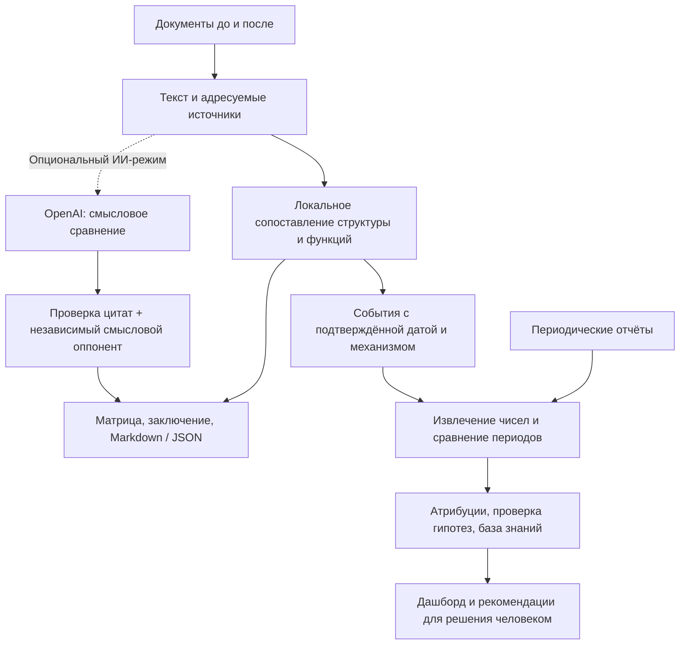

# QAITU · карта ответственности


<p align="center">
  <strong>ИИ-агент для анализа организационной структуры и функций</strong><br>
  HackAlem AI · спецтрек Казахтелеком · ветка <code>mvp-nurtas</code>
</p>

<p align="center">
  <a href="#features">Возможности</a> ·
  <a href="#quickstart">Быстрый запуск</a> ·
  <a href="#demo">Демонстрация</a> ·
  <a href="#architecture">Архитектура</a> ·
  <a href="#checks">Проверки</a>
</p>

При реорганизации важно сохранить обязанности, разделить ответственность и не пропустить пересечения. **QAITU сравнивает комплекты документов «до» и «после»**, показывает изменения в матрице функций и собирает заключение с цитатами, которые можно проверить.

Дополнительный модуль сопоставляет изменения структуры с показателями из периодических отчётов: как изменились сроки, объём проверок, нагрузка и качество.

> **Рабочий прототип.** Выводы показывают возможные риски и требуют проверки сотрудником. Демо, реальные документы и наблюдаемые эффекты явно разделены.

<a id="features"></a>
## Что умеет QAITU

| Вопрос сотрудника | Результат в приложении |
|---|---|
| Какие подразделения изменились? | Сохранённые, созданные, упразднённые и преобразованные подразделения с источниками |
| Куда перешли обязанности? | Сопоставление функций, включая передачу между отделами и разделение одной обязанности на несколько |
| Что могло потеряться? | Кандидаты на утрату закрепления с прежней формулировкой и рассмотренным новым контекстом |
| Где пересекается ответственность? | Возможные дубли и конфликты исполнения и независимого контроля |
| На чём основан вывод? | Документ, пункт или локатор, исходная цитата и идентификатор источника |
| Что передать руководителю? | Обзор результатов и выгрузка заключения в Markdown или JSON |

**Форматы:** DOCX · PDF с текстовым слоем · XLSX · XLSM. Можно загрузить несколько файлов в каждый комплект: положения, должностные инструкции, приказы и приложения.

### Матрица «функция × подразделение»

Строка объединяет сопоставленные назначения одной функции. Колонки показывают подразделения до и после изменений. При выборе строки открываются обе редакции цитат и контекст, по которому определён ответственный.

| Сигнал | Как его читать |
|---|---|
| 🔵 Изменение | Назначение добавлено, передано или изменено |
| 🔴 Ответственный после не найден | В новом комплекте не найдено подходящего назначения; требуется проверка |
| 🟡 Несколько владельцев | Возможное пересечение; нужно сверить предмет, роль и область ответственности |
| `?` | Владельца или назначение нельзя уверенно определить |
| `×` | Подразделение отсутствует в перечне этой редакции |

Пустая ячейка отражает отсутствие **найденного закрепления в загруженных документах**. Повтор одной обязанности в положении и должностной инструкции сохраняет оба источника, но не создаёт второго исполнителя. Права, обязанности и запреты анализируются раздельно.

<a id="quickstart"></a>
## Быстрый запуск

Понадобятся **Python 3.10+**, Git и доступ к репозиторию. Для локального демо ключ OpenAI не нужен.

```bash
git clone --branch mvp-nurtas https://github.com/BAITC-Hacks/hack-0dd0a2e7-ai-qaitu.git
cd hack-0dd0a2e7-ai-qaitu

python3 -m venv .venv
source .venv/bin/activate
python -m pip install -r requirements.txt
python -m streamlit run app.py
```

Откройте **[localhost:8501](http://localhost:8501)** или адрес, который выведет Streamlit. Нажмите **«Запустить контрольный пример» в центре стартового экрана** — этот пример всегда выполняется локально.

<details>
<summary><strong>Windows · PowerShell</strong></summary>

После клонирования репозитория выполните в его корне:

```powershell
py -3 -m venv .venv
.\.venv\Scripts\python.exe -m pip install -r requirements.txt
.\.venv\Scripts\python.exe -m streamlit run app.py
```

Активация окружения не требуется. В дальнейших командах заменяйте `python` на `.\.venv\Scripts\python.exe`.

</details>

<details>
<summary><strong>Docker · запуск с сохранением результатов метрик</strong></summary>

```bash
docker build -t qaitu .
docker run --rm -p 8501:8501 \
  -v qaitu-data:/app/data \
  -v qaitu-runs:/app/runs \
  qaitu
```

Образ использует Python 3.12. Именованные тома сохраняют базу знаний и результаты после остановки контейнера.

Для ИИ-режима передайте заранее заданные переменные окружения, добавив к `docker run` параметры `--env OPENAI_API_KEY --env OPENAI_MODEL` перед именем образа.

</details>

<a id="workflow"></a>
## От документов к заключению

1. В разделе **«Структура и функции»** загрузите комплекты **«До изменений»** и **«После изменений»**. Порядок редакций задаёте вы.
2. Выберите **«Локальное сравнение»** или **«ИИ + локальное сравнение»** и нажмите **«Сравнить документы»**.
3. Начните с обзора и заключения. Перейдите к структуре, матрице или ИИ-сравнению через навигацию над результатами.
4. Откройте интересующий вывод и проверьте цитаты. Фильтры и страницы матрицы не сокращают полный экспорт.
5. Скачайте Markdown для чтения или JSON для дальнейшей обработки.

Для Word источник указывает абзац или строку таблицы, для PDF — физическую страницу, для Excel — лист и строку. Номер пункта сохраняется в тексте, если присутствует в извлечённом фрагменте.

<a id="ai"></a>
## ИИ, которому можно задать вопрос «откуда это?»

ИИ-проверка дополняет локальное сопоставление. Каждый публикуемый ИИ-вывод проходит два этапа:

1. **Проверка источников:** идентификатор существует, цитата буквально присутствует в документе, стороны «до» и «после» указаны корректно.
2. **Независимая смысловая проверка:** второй запрос оценивает, подтверждают ли источники предложенное утверждение с учётом контекста и ограничений.

Если проверка не завершилась, непроверенные ИИ-выводы исключаются. Локальный результат остаётся доступным. Интерфейс показывает статус, охват источников и доступные сведения о расходе токенов.

### Подключить OpenAI

Создайте в корне проекта файл `.streamlit/secrets.toml`:

```toml
OPENAI_API_KEY = "<ваш API-ключ>"
OPENAI_MODEL = "gpt-5.4-mini"
```

Файл исключён из Git и Docker-контекста. Вместо него можно задать переменные окружения с теми же именами — они имеют приоритет. `OPENAI_MODEL` необязателен, `.env` автоматически не читается.

При наличии серверного ключа основной интерфейс выбирает ИИ-режим по умолчанию, но запрос начинается только по кнопке запуска. **Центральное демо всегда локальное; одноимённая кнопка в боковой панели следует выбранному режиму.** У модуля метрик свои отдельные действия ИИ.

ИИ-режим передаёт в OpenAI текстовые фрагменты и их контекст и расходует API-бюджет. Модельная перепроверка помогает отсеивать ошибки, но не гарантирует правильность всех трактовок.

[Настройки, CLI, ограничения пакетов и значения статусов →](docs/AI_COMPARISON.md)

<a id="metrics"></a>
## Эффективность и оптимизация

Второй рабочий раздел отвечает на следующий вопрос: **что наблюдается в показателях после изменения структуры?** Он запускается отдельно от сравнения положений.

| Раздел | Что можно сделать |
|---|---|
| **Отчёты** | Загрузить Excel, PDF или Word, проверить числа по источникам и подтвердить неоднозначные сопоставления |
| **Дашборд метрик** | Посмотреть временные ряды, даты реорганизаций и подтверждённую контрольную группу |
| **Изменение → эффект** | Изучить предполагаемый механизм, уверенность, альтернативные объяснения и вердикт оппонента |
| **Прогноз vs факт** | Проверить наступившие прогнозы по отчётам и увидеть определённые и неопределённые результаты |
| **Рекомендации** | Рассмотреть действия с основаниями и сохранить решение: принять, отклонить или обсудить |
| **База знаний** | Посмотреть накопленные наблюдения и число независимых случаев |

Модуль выбирает простое сравнение, поправку на тренд или разность разностей при подходящей контрольной группе. Объёмные показатели дополнительно нормализуются на FTE, если есть соответствующие данные. Периоды, пересекающие дату изменения, исключаются; проценты не суммируются, разные валюты не сравниваются без приведения.

**Каждое число сохраняет источник.** Связь функции с метрикой и выбор контрольной группы подтверждает человек. Уверенность рассчитывается правилами, а повторная загрузка одного случая не увеличивает число независимых наблюдений.

Отчёты можно загрузить через интерфейс или разместить в `data/reports/`. Неизвестные показатели поступают на подтверждение как `custom_*`. Для извлечения из свободного текста PDF/Word доступен отдельный ИИ-режим.

```bash
# Сгенерировать тестовые отчёты отдельно от интерфейса
python scripts/gen_synthetic_reports.py --output data/synthetic_reports

# Запустить только основное сравнение документов
METRICS_MODULE=off python -m streamlit run app.py
```

> Наблюдаемое изменение показателя не устанавливает причину. Статистическая значимость не рассчитывается. Реальные и синтетические данные обрабатываются раздельно.

[Этапы M1–M9, правила уверенности и ограничения модуля →](docs/METRICS_MODULE_IMPLEMENTATION.md)

<a id="demo"></a>
## Демонстрация для жюри

Оба встроенных сценария доступны без собственных файлов и оплачиваемых запросов.

| Сценарий | Как запустить | Что показать |
|---|---|---|
| **Структура и функции** | Центральная кнопка «Запустить контрольный пример» на стартовом экране | Преобразование подразделения, передачу функций, возможную потерю, дубль и конфликт ролей; затем открыть подтверждающие цитаты |
| **Эффективность** | «Эффективность и оптимизация» → «ТЕСТОВЫЕ ДАННЫЕ» → «Запустить демо эффективности» | Рост задержки отчётности, изменение числа ИТ-проверок, найм как альтернативное объяснение, проверку прогнозов и накопление наблюдений |

Синтетика метрик содержит **9 Excel-файлов, 19 показателей и 2 052 значения за 2021–2023 годы**. Эффекты заданы в генераторе. Экраны, графики и выгрузки имеют метку **«ТЕСТОВЫЕ ДАННЫЕ»**; они не описывают фактические результаты компании.

Для предоставленной организатором пары порядок иной: **редакция 8, протокол №13, 2021 год → редакция 9, протокол №7, 2022 год**. Эти документы загружаются отдельно. На показе удобно начать с двух новых департаментов, затем открыть перенос функции и источники обеих редакций.

<a id="architecture"></a>
## Как устроено решение



| Слой | Технологии и код |
|---|---|
| Интерфейс | Streamlit, Pandas, Altair · [`app.py`](app.py), [`metrics_ui.py`](qaitu/metrics_ui.py) |
| Оформление | Дизайн из `main`, светлая и тёмная темы · [`presentation.py`](qaitu/presentation.py), [`workspace.css`](qaitu/static/workspace.css) |
| Документы | pypdf, pdfplumber, python-docx, openpyxl · [`extractors.py`](qaitu/extractors.py), [`metrics_ingest.py`](qaitu/metrics_ingest.py) |
| Основной анализ | Правила, лексическое сопоставление, модели назначений · [`analyzer.py`](qaitu/analyzer.py), [`models.py`](qaitu/models.py) |
| ИИ-сравнение | OpenAI Responses API, строгие JSON-схемы, проверка цитат и смысла · [`ai_agent.py`](qaitu/ai_agent.py), [`ai_verifier.py`](qaitu/ai_verifier.py) |
| Метрики | Детерминированные расчёты и опциональные ИИ-этапы · [`metrics_analysis.py`](qaitu/metrics_analysis.py), [`metrics_llm.py`](qaitu/metrics_llm.py) |
| Сохранение | SQLite и JSON по этапам · [`metrics_store.py`](qaitu/metrics_store.py) |
| Проверки | unittest, Streamlit AppTest, контрольные сценарии · [`tests/`](tests/) |

<a id="checks"></a>
## Проверки и воспроизводимость

Последний зафиксированный прогон приложения — **`f48c923`, 23 сентября 2026 года**:

| Проверка | Результат |
|---|---|
| Автоматические тесты | **178 пройдено** |
| Выбранные условия на реальных редакциях 8 и 9 | **15 из 15** |
| Извлечение синтетических метрик с проверкой ячеек | **2 052 из 2 052** |
| Браузерная проверка | Компьютер, мобильный экран, разделы модуля и скачивание отчёта |

Запустить автоматические тесты из корня проекта:

```bash
python -m unittest discover -s tests -v
```

Тесты API используют подменённые ответы и не выполняют оплачиваемые вызовы. Успешные проверки не являются оценкой полной точности на произвольном корпусе документов.

<details>
<summary><strong>Проверить предоставленную пару положений</strong></summary>

Исходные файлы в репозиторий не включены. Укажите свои пути:

```bash
python scripts/check_real_documents.py \
  --before "/path/to/edition-8.docx" \
  --after "/path/to/edition-9.docx"
```

Скрипт проверяет выбранные вручную условия, печатает `PASS` / `FAIL` и возвращает ненулевой код при несоответствии. Это ограниченная приёмочная выборка, а не официальный эталон всех выводов.

</details>

<a id="boundaries"></a>
## Границы прототипа

- **Сложные исходники.** Для PDF-сканов и графических оргсхем нужен предварительный OCR. Нетипичные таблицы, сокращения и сильные перефразировки могут требовать ручной сверки.
- **Охват выводов.** Агент анализирует предоставленные материалы. Непереданная инструкция или приложение могут изменить результат; совпадение цитаты само по себе не доказывает правильность трактовки.
- **Метрики.** Реальные периодические отчёты пока не предоставлены. Полный демонстрационный цикл проверен на явно обозначенной синтетике.
- **Прогнозы.** Сейчас доступны ручные и демонстрационные гипотезы. Автоматического таймлайна, симулятора и редактора правок в ядре нет. Ручные прогнозы исключаются из показателя точности агента.
- **Внешняя оценка.** Проверка законодательства и сравнение с другими операторами не реализованы; в исходном ТЗ это опциональные возможности.

## Где находятся данные

Основное сравнение обрабатывает загруженные файлы в памяти сервера. Модуль метрик сохраняет извлечённые значения, цитаты и результаты, чтобы решения можно было проверить позже.

| Путь | Содержимое |
|---|---|
| `.streamlit/secrets.toml` | Локальные настройки OpenAI |
| `data/reports/` | Реальные отчёты, которые пользователь размещает для обработки |
| `data/synthetic_reports/` | Сгенерированный тестовый комплект |
| `runs/<run_id>/metrics/` | Результаты этапов M1–M9, включая источники |
| `data/kb.sqlite` | База наблюдений, подтверждённые механизмы и решения по рекомендациям |

Эти пути исключены из Git и Docker-контекста. Частный документ, помещённый в произвольную другую папку, автоматически от Git не защищён. При удалённом запуске данные обрабатываются и сохраняются на соответствующем сервере; в ИИ-режиме выбранные фрагменты также передаются в OpenAI. Ключи не включаются в отчёты.

## Документация ветки

- [Текущий прогресс и сохранённые рабочие материалы](PROGRESS.md)
- [Настройка ИИ-сравнения, CLI и статусы обработки](docs/AI_COMPARISON.md)
- [Модуль эффективности: этапы, расчёты и ограничения](docs/METRICS_MODULE_IMPLEMENTATION.md)
- [Исходная спецификация оформления](docs/superpowers/specs/2026-09-23-liquid-glass-design.md)

---

<p align="center"><strong>QAITU</strong> · от изменения в документе к проверяемому выводу</p>
