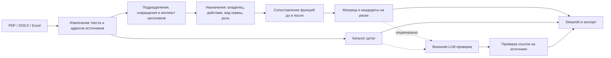

# QAITU — сравнение структуры и функций до/после

Прототип для кейса HackAlem AI «Анализ организационной структуры и функционала». Загрузите два комплекта документов: приложение сопоставит подразделения и назначения функций, покажет изменения в тепловой матрице и сформирует список вопросов для экспертной проверки с цитатами.

Объединённая версия сохраняет проверенный разбор исходных PDF/DOCX и сопоставление переименованных подразделений по профилю функций, а также добавляет контекст владельца и заголовка, сокращения подразделений, права и запреты, сопоставление нескольких назначений одной функции и матрицу «функция × подразделение».

## Запуск за несколько минут

Нужен Python 3.10 или новее. Команды выполняются из корня репозитория.

```bash
python3 -m venv .venv
source .venv/bin/activate
python -m pip install -r requirements.txt
python -m streamlit run app.py
```

В Windows PowerShell активация окружения: `.venv\Scripts\Activate.ps1`.

Откройте локальный адрес Streamlit из терминала, обычно `http://localhost:8501`. Нажмите **«Запустить контрольный пример»** — API-ключ и собственные файлы для демо не нужны. По умолчанию обработка локальная; вызовы внешней модели выполняются только после включения отдельной опции.

### Оформление рабочего пространства

Интерфейс использует материалы в стиле Liquid Glass: полупрозрачную боковую
панель, световые кромки, мягкие тени и закреплённую навигацию по результатам. Это веб-адаптация
референсов из Figma и After Effects. Матрица и исходные цитаты остаются на плотном
фоне для чтения. Светлая, тёмная и системная темы доступны через меню Streamlit
в правом верхнем углу. На телефоне комплекты документов открываются кнопкой
боковой панели, а широкая матрица прокручивается внутри своего блока.

После анализа верхняя панель ведёт к обзору, матрице, заключению, структуре,
источникам и экспорту без повторного запуска анализа. Матрица показывает по 10
строк на странице и использует широкую текстовую колонку. Блоки назначений
«до/после» располагаются рядом, а на узком экране — друг под другом; исходные
цитаты раскрываются отдельно. Информационные плашки согласованы с зелёной
палитрой, предупреждения и ошибки сохраняют смысловые цвета.

Стили находятся в `qaitu/static/workspace.css`, оформление первого экрана в
`qaitu/presentation.py`, палитры стандартных элементов в `.streamlit/config.toml`.
Дополнительные библиотеки, внешние шрифты и сетевые ресурсы для оформления не
нужны. Учитываются системные настройки уменьшения движения, прозрачности и
повышенного контраста. CSS привязан к структуре Streamlit 1.64: при обновлении
Streamlit проверяйте загрузку файлов, якорную навигацию, обе темы и мобильный экран.

Docker:

```bash
docker build -t qaitu .
docker run --rm -p 8501:8501 qaitu
```

## Сценарий работы

1. Загрузите положения, приложения с текстовой оргструктурой, должностные инструкции или другие внутренние документы в комплекты **«До изменений»** и **«После изменений»**. Поддерживаются PDF с текстовым слоем, DOCX, XLSX и XLSM. Порядок версий задаёт пользователь.
2. Нажмите **«Сравнить документы»**. Проверьте предупреждения о чтении файлов и распознавании владельцев.
3. Начните с обзора и раздела **«Заключение»**: сначала показаны охват, индикаторы рисков и изменения структуры. Полный Markdown-отчёт и JSON скачиваются отдельно; выводить весь каталог цитат на защите не требуется.
4. Через верхнюю панель перейдите к **«Структуре»** или **«Матрице функций»**. В одной строке матрицы собраны соответствующие назначения функции, в колонках — подразделения до и после. Отфильтруйте строки по виду нормы, статусу или тексту, выберите строку и проверьте цитаты обеих версий. В разделе **«Источники и охват»** доступен поиск по всему каталогу.
5. Скачайте результат для проверки командой. JSON содержит каталог источников, назначения, матрицу и выводы; Markdown — читаемое заключение с рекомендациями и полным каталогом цитат.

Каждая ссылка состоит из названия документа, локатора и `source_id`. Для DOCX используется абзац или строка таблицы, для PDF — физическая страница, для Excel — лист и строка. Локатор не заменяет напечатанный номер пункта: номер сохраняется в тексте, если он присутствует в извлечённом фрагменте.

## Как читать матрицу

| Состояние | Значение |
|---|---|
| Назначение сохранено | В обоих комплектах найдено соответствующее закрепление за владельцем |
| Назначение добавлено или передано | Изменился набор владельцев функции |
| Ответственный после не найден | Для старой функции не найдено достаточно близкого назначения в доступном новом тексте; это кандидат на проверку |
| Несколько владельцев | Нужно проверить разделение ролей и областей ответственности; количество отметок само по себе не доказывает дубль |
| Недостаточно данных | Новый комплект не дал достаточного материала для сопоставления |

Синий цвет обозначает изменения назначений, красный — отсутствие найденного преемника, жёлтый — возможное пересечение. `?` означает неопределённость, `×` — отсутствие подразделения в перечне выбранной версии, точка — отсутствие прямого назначения. Матрица выводится страницами; фильтры не меняют глобальный вывод и полный экспорт.

Повторение одного назначения в положении и должностной инструкции сохраняет оба источника, но не создаёт второго владельца. Сопоставление учитывает отношения «один ко многим» и «многие к одному», включая разделение одной составной прежней обязанности на несколько новых пунктов. Права и запреты отделяются от обязанностей; запрет выполнять процесс не считается его исполнением. Титульные утверждения и разделы определений не превращаются в назначения функций.

## Демонстрация для жюри

Встроенный пример — **синтетический** комплект, который можно показывать без исходных документов организатора.

| Шаг | Ожидаемое наблюдение |
|---|---|
| Подразделения | Отдел внутреннего аудита заменён департаментом; создано Управление аудита закупок |
| Передача | Разработка методики и ведение реестра переданы от Сектора методологии |
| Возможная потеря | В новом комплекте не найдено проверки антикоррупционных требований |
| Возможный дубль | Аудит закупок закреплён за двумя подразделениями |
| Потенциальный конфликт | Управление аудита закупок выполняет закупочные процедуры и проверяет их |
| Доказательства | У каждого вывода видны исходные фрагменты; назначения матрицы также имеют источники |

Демо проверяет положительные случаи. Оно не является оценкой точности на произвольных корпоративных документах.

## Проверки

Все автоматические тесты выполняются локально, без API-ключа:

```bash
python -m unittest discover -s tests -v
```

Тесты внешнего API используют подменённые ответы; успешный вызов оплачиваемой модели ими не проверяется. Автоматические проверки интерфейса проверяют сценарии и состояние Streamlit, но не заменяют просмотр в браузере. Проверки не измеряют полноту извлечения всех обязанностей или точность на произвольном корпусе.

Регрессионные сценарии проверяют владельцев по сокращениям и заголовкам, общие обязанности нескольких подразделений, наследование запретов, отсутствие переноса владельца между файлами, перенумерацию прав, сохранение источников и отсутствие ложной потери при объединении назначений.

Для локальной проверки двух предоставленных редакций положения о внутреннем аудите есть отдельный скрипт. Документы в репозиторий не включены:

```bash
python scripts/check_real_documents.py \
  --before "/path/to/edition-8.pdf" \
  --after "/path/to/edition-9.docx"
```

Правильный порядок этой пары: редакция 8 (2021 год, протокол №13) → редакция 9 (2022 год, протокол №7). Скрипт проверяет выбранные вручную условия: два новых департамента, сохранение прежних, передачу отдельных назначений СВК, отчётность ДККМ, права после перенумерации, сопоставление составной обязанности с двумя новыми пунктами, отсутствие титула и определений среди функций и существование источников. Он печатает `PASS` / `FAIL` и завершает работу с ненулевым кодом при несоответствии. Это ограниченная приёмочная выборка, не официальный датасет и не полная проверка всех выводов.

Если PDF отдаёт по одному слову в строке, извлечение автоматически использует режим восстановления расположения текста. Для сканированных страниц без текстового слоя по-прежнему нужен OCR.

## Архитектура



| Модуль | Назначение |
|---|---|
| `qaitu/extractors.py` | Чтение файлов, адресуемые фрагменты и предупреждения |
| `qaitu/analyzer.py` | Каталог подразделений, контекст назначений, лексическое сопоставление и индикаторы рисков |
| `qaitu/models.py` | Структуры данных, строки матрицы и сериализация результата |
| `qaitu/ai_reviewer.py` | Необязательная проверка внешней моделью и валидация ссылок |
| `qaitu/reporting.py` | Читаемый отчёт Markdown и полный каталог доказательств |
| `qaitu/demo.py` | Контрольный синтетический комплект |
| `app.py` | Загрузка, запуск, матрица, просмотр доказательств и экспорт |
| `tests/` | Воспроизводимые проверки поведения на синтетических данных |
| `scripts/check_real_documents.py` | Локальная приёмочная выборка для редакций 8 и 9 |

Назначение функции хранит исходный фрагмент и контекст владельца. Строка матрицы объединяет соответствующие назначения обеих версий; исходные цитаты не заменяются сгенерированным текстом. Неопределённый владелец остаётся явно неопределённым.

## Необязательная LLM-проверка

В боковой панели раскройте **«Дополнительная ИИ-проверка»**, отметьте **«Разрешаю отправку фрагментов во внешний API»**, укажите свой API-ключ и доступную вам модель. Эта опция отправляет выбранные фрагменты документов во внешний API. Без неё приложение работает локально.

Материал разбивается на пакеты: максимум 8 запросов по 60 000 символов JSON. Цитаты передаются целиком; не вошедшие фрагменты и число обработанных пакетов отражаются в предупреждениях. Связи между разными пакетами могут быть пропущены. Ошибка API, отказ или некорректный ответ модели сохраняют локальный результат. Автоматических повторов запроса нет. Между пакетами проверяется бюджет 180 секунд; сетевой таймаут запроса — до 45 секунд в пределах оставшегося бюджета. Это не обещание остановки сетевой операции ровно в указанный момент. Число запросов и доступные данные об использованных токенах выводятся в предупреждениях.

Модель дополняет список кандидатов на риски; она не переписывает автоматически реестр подразделений и назначений. Программа проверяет, что возвращённые ссылки относятся к переданным источникам. Существование цитаты **не доказывает**, что она подтверждает вывод: итог всё равно проверяет сотрудник.

Текст документов рассматривается как анализируемые данные. Инструкции, содержащиеся внутри загруженных файлов, не являются командами пользователя приложению.

## Ограничения

- Локальный анализ использует правила и лексическое сходство. Сильные перефразировки, сложная вложенность, неоднозначные должности и нетипичные сокращения могут быть распознаны неверно. Коэффициенты сходства — технические оценки, а не калиброванная вероятность правильности.
- Матрица отражает **распознанные назначения в загруженном комплекте**. Пустота не доказывает, что функцию никто не выполняет в организации; отсутствующая инструкция или ссылка на непредоставленное приложение может изменить вывод.
- Несколько владельцев требуют проверки предмета, роли и области ответственности. Автоматически подтвердить конфликт интересов или юридическое нарушение прототип не может.
- Лимиты чтения: файл до 25 МБ, распакованный документ до 100 МБ, до 20 000 фрагментов и 5 млн символов; PDF до 1 000 страниц, Excel до 50 листов, 10 000 строк и 200 столбцов на лист. Превышение отклоняется с сообщением, а не скрытым обрезанием.
- OCR сканов и распознавание оргсхем из изображений не реализованы. Сложные PDF, таблицы и автоматическая нумерация Word могут требовать ручной сверки.
- Нет полного семантического графа, согласования решений экспертом, сравнения с законодательством и бенчмаркинга других операторов. Эти функции не заявлены как реализованные.
- Прототип предназначен для демонстрации и экспертного рассмотрения; это не система с промышленными гарантиями полноты и точности.

## Работа с данными

Загруженные файлы обрабатываются в памяти процесса; приложение не записывает их в репозиторий. При удалённом размещении файлы поступают на сервер, где запущен Streamlit. API-ключ вводится в поле пароля и используется для выбранного запроса. Не добавляйте ключи, реальные документы и выгрузки с их цитатами в Git. Встроенный синтетический пример не содержит данных организатора.
